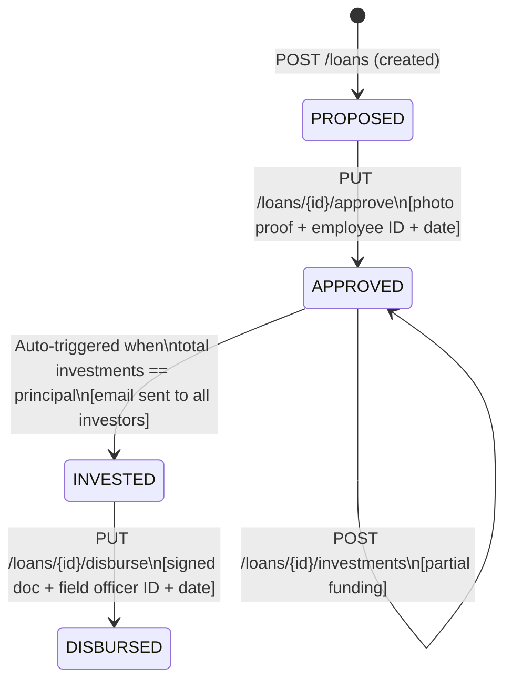
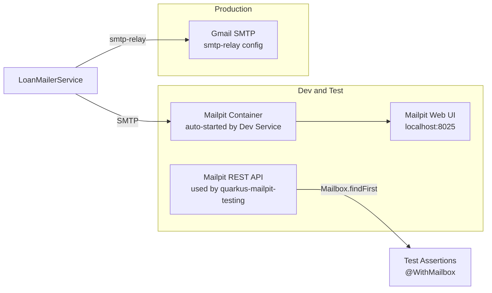

# Loan Service — Quarkus 3.x (Gradle) Design Plan

## Problem Summary

A Loan Engine that manages the lifecycle of a loan across 4 forward-only states with strict guard conditions, multiple stakeholders, and two integration points (PDF generation + email).

---

## State Machine




---

## Data Model

### Entities

`**Loan**` (core aggregate)

- `id` UUID PK
- `borrowerId` String NOT NULL
- `principalAmount` BigDecimal NOT NULL
- `rate` BigDecimal NOT NULL — annual flat interest rate for borrower (e.g. 10.0 = 10%)
- `roi` BigDecimal NOT NULL — annual return on investment for investors (e.g. 8.0 = 8%)
- `status` Enum `(PROPOSED, APPROVED, INVESTED, DISBURSED)`
- `agreementLetterUrl` String — path to generated PDF (set on APPROVED transition)
- `createdAt`, `updatedAt` LocalDateTime

`**LoanApproval**` (1:1 with Loan)

- `id` UUID PK
- `loan` FK
- `fieldValidatorPhotoProofPath` String — stored upload path
- `fieldValidatorEmployeeId` String NOT NULL
- `approvalDate` LocalDate NOT NULL

`**LoanInvestment**` (1:N with Loan)

- `id` UUID PK
- `loan` FK
- `investorId` String NOT NULL
- `investorEmail` String NOT NULL — needed for notification
- `amount` BigDecimal NOT NULL
- `investedAt` LocalDateTime

`**LoanDisbursement**` (1:1 with Loan)

- `id` UUID PK
- `loan` FK
- `signedAgreementLetterPath` String NOT NULL
- `fieldOfficerEmployeeId` String NOT NULL
- `disbursementDate` LocalDate NOT NULL

### Schema via Flyway

`src/main/resources/db/migration/V1__init.sql`

---

## System Architecture

```mermaid
flowchart TD
    Client -->|HTTP JSON| LoanResource
    Client -->|Multipart| LoanResource

    subgraph api [API Layer]
        LoanResource[LoanResource\nREST endpoints]
        InvestmentResource[InvestmentResource]
    end

    subgraph domain [Domain Layer]
        LoanService[LoanService\n@ApplicationScoped]
        LoanStateValidator[LoanStateValidator\nguard conditions]
        LoanRepository[LoanRepository\nPanache]
        InvestmentRepository[InvestmentRepository]
    end

    subgraph infra [Infrastructure Layer]
        PdfGenerator[AgreementLetterGenerator\nApache PDFBox]
        Mailer[LoanMailerService\nQuarkus Mailer + Mailpit]
        FileStore[FileStorageService\nlocal filesystem]
        CdiEvents[CDI Events\nLoanFullyFundedEvent]
    end

    LoanResource --> LoanService
    InvestmentResource --> LoanService
    LoanService --> LoanRepository
    LoanService --> InvestmentRepository
    LoanService --> LoanStateValidator
    LoanService -->|fires| CdiEvents
    CdiEvents -->|observes| Mailer
    LoanService --> PdfGenerator
    LoanService --> FileStore
```


---

## Key Assumptions (marked as assumptions)

1. **[ASSUMPTION]** Agreement letter PDF is generated when loan transitions to `APPROVED`. The URL is stored on the `Loan` entity.
2. **[ASSUMPTION]** Roles: `STAFF` (approve), `INVESTOR` (invest), `FIELD_OFFICER` (disburse), `ADMIN` (all).
3. **[ASSUMPTION]** Multiple investments from the same investor are allowed (separate tranches).
4. **[ASSUMPTION]** `borrowerId` references an external Borrower service; no borrower management in this service.
5. **[ASSUMPTION]** Currency is always IDR. `BigDecimal` with scale=2 used throughout.
6. **[ASSUMPTION]** Email is fired asynchronously via CDI `@Observes` to decouple from transaction.
7. **[ASSUMPTION]** For demo, files (photo proof, signed agreement) are stored on local filesystem under a configurable `loan.storage.upload-dir`.
8. **[ASSUMPTION]** For production e-signing, Privy.id (Indonesian e-sign) or DocuSign would integrate here; for demo, uploading a pre-signed PDF suffices.
9. **[ASSUMPTION]** A loan can have at most one `APPROVED/INVESTED/DISBURSED` state at any time (enforced by service layer).
10. **[ASSUMPTION]** `rate` and `roi` are stored as percentage values (e.g., `10.00` = 10%).

---

## RESTful API Contracts

### Loans


| Method | Path                                  | Body / Form                                                             | Description                                            | Roles                |
| ------ | ------------------------------------- | ----------------------------------------------------------------------- | ------------------------------------------------------ | -------------------- |
| `POST` | `/api/v1/loans`                       | JSON `CreateLoanRequest`                                                | Create loan → PROPOSED                                 | STAFF, ADMIN         |
| `GET`  | `/api/v1/loans/{id}`                  | —                                                                       | Get loan detail                                        | ALL                  |
| `GET`  | `/api/v1/loans`                       | `?status=&borrowerId=&page=&size=`                                      | List loans                                             | ALL                  |
| `PUT`  | `/api/v1/loans/{id}/approve`          | Multipart: `photoProof` (file) + `employeeId` + `approvalDate`          | Approve → APPROVED                                     | STAFF, ADMIN         |
| `GET`  | `/api/v1/loans/{id}/agreement-letter` | —                                                                       | Download agreement PDF                                 | ALL                  |
| `POST` | `/api/v1/loans/{id}/investments`      | JSON `AddInvestmentRequest`                                             | Add investment; auto-transitions to INVESTED when full | INVESTOR, ADMIN      |
| `GET`  | `/api/v1/loans/{id}/investments`      | —                                                                       | List all investments                                   | ALL                  |
| `PUT`  | `/api/v1/loans/{id}/disburse`         | Multipart: `signedAgreement` (file) + `employeeId` + `disbursementDate` | Disburse → DISBURSED                                   | FIELD_OFFICER, ADMIN |


`**CreateLoanRequest`**

```json
{ "borrowerId": "B-001", "principalAmount": 5000000.00, "rate": 10.0, "roi": 8.0 }
```

`**AddInvestmentRequest**`

```json
{ "investorId": "INV-001", "investorEmail": "investor@example.com", "amount": 2000000.00 }
```

`**LoanResponse**` (returned by GET/POST/PUT)

```json
{
  "id": "uuid",
  "borrowerId": "B-001",
  "principalAmount": 5000000.00,
  "rate": 10.0,
  "roi": 8.0,
  "status": "APPROVED",
  "totalInvested": 2000000.00,
  "remainingAmount": 3000000.00,
  "agreementLetterUrl": "/api/v1/loans/{id}/agreement-letter",
  "approval": { "fieldValidatorEmployeeId": "EMP-001", "approvalDate": "2026-04-06" },
  "disbursement": null,
  "createdAt": "2026-04-06T10:00:00"
}
```

---

## Free Tools / Libraries


| Concern                  | Tool                                                            | License / Tier             |
| ------------------------ | --------------------------------------------------------------- | -------------------------- |
| PDF Generation           | **Apache PDFBox 3.x**                                           | Apache 2.0 — fully free    |
| Email (dev/test)         | **Quarkus Mailpit** Dev Service (auto-starts Mailpit container) | Apache 2.0 — fully free    |
| Email (production relay) | **Gmail SMTP** via `quarkus.mailpit.smtp-relay-`*               | Free — use app password    |
| Email test assertions    | **quarkus-mailpit-testing** (`@WithMailbox`, `@InjectMailbox`)  | Apache 2.0                 |
| Database (test)          | **H2 in-memory**                                                | EPL — bundled with Quarkus |
| Database (dev/prod)      | **PostgreSQL**                                                  | Open source                |
| File storage             | Local filesystem                                                | n/a                        |


### How Mailpit Fits In




- **Zero config in dev/test**: adding `quarkus-mailpit` is sufficient — it auto-wires the mailer SMTP settings to the Mailpit container.
- **Test assertions**: annotate the test class with `@WithMailbox`, inject `@InjectMailbox Mailbox mailbox`, then call `mailbox.findFirst(email)` to verify subject, recipients, and body.
- **Production relay**: set `quarkus.mailpit.smtp-relay-host`, `smtp-relay-port`, and credentials in `application.properties` (or env vars) to forward through Gmail or any SMTP provider.

```properties
# application.properties — production relay via Gmail
%prod.quarkus.mailpit.smtp-relay-host=smtp.gmail.com
%prod.quarkus.mailpit.smtp-relay-port=587
%prod.quarkus.mailpit.smtp-relay-starttls=true
%prod.quarkus.mailpit.smtp-relay-auth=plain
%prod.quarkus.mailpit.smtp-relay-username=${GMAIL_USER}
%prod.quarkus.mailpit.smtp-relay-password=${GMAIL_APP_PASSWORD}
%prod.quarkus.mailpit.smtp-relay-all=true
```

---

## Project Structure

```
src/
  main/java/com/amartha/loan/
    api/
      resource/
        LoanResource.java
        LoanInvestmentResource.java
      dto/
        request/   CreateLoanRequest, AddInvestmentRequest
        response/  LoanResponse, InvestmentResponse, ErrorResponse
    domain/
      model/       Loan, LoanApproval, LoanInvestment, LoanDisbursement, LoanStatus
      repository/  LoanRepository, LoanInvestmentRepository
      service/     LoanService
      event/       LoanFullyFundedEvent
      exception/   InvalidLoanStateException, InvestmentExceedsPrincipalException
    infrastructure/
      pdf/         AgreementLetterGenerator   (PDFBox)
      email/       LoanMailerService          (Quarkus Mailer + Mailpit Dev Service + CDI @Observes)
      storage/     FileStorageService
    config/        LoanConfig                 (@ConfigMapping)
  main/resources/
    db/migration/V1__init.sql
    agreement-letter-template/  (fonts, logo placeholder)
    application.properties
  test/java/com/amartha/loan/
    api/           LoanResourceTest, LoanInvestmentResourceTest (@QuarkusTest)
    domain/        LoanServiceTest, LoanStateValidatorTest (unit)
    infrastructure/ AgreementLetterGeneratorTest, FileStorageServiceTest
```

---

## TDD Test Cases

### Phase 1 — Write tests FIRST (red), then implement (green), then refactor

#### `LoanResourceTest` (`@QuarkusTest` — integration)

1. `createLoan_withValidData_returns201_andStatusIsProposed`
2. `createLoan_withMissingBorrowerId_returns400`
3. `createLoan_withNegativePrincipal_returns400`
4. `createLoan_withZeroRate_returns400`
5. `approveLoan_withValidMultipartData_returns200_andStatusIsApproved`
6. `approveLoan_onAlreadyApprovedLoan_returns409`
7. `approveLoan_withMissingPhotoProof_returns400`
8. `approveLoan_withMissingEmployeeId_returns400`
9. `disburseLoan_withValidData_returns200_andStatusIsDisbursed`
10. `disburseLoan_onNonInvestedLoan_returns409`
11. `disburseLoan_withMissingSignedAgreement_returns400`
12. `getLoan_withExistingId_returns200`
13. `getLoan_withUnknownId_returns404`
14. `listLoans_filterByStatus_returnsMatchingLoans`

#### `LoanInvestmentResourceTest` (`@QuarkusTest` — integration)

1. `addInvestment_toApprovedLoan_returns201`
2. `addInvestment_exceedingRemainingPrincipal_returns422`
3. `addInvestment_toProposedLoan_returns409` (wrong state)
4. `addInvestment_withZeroAmount_returns400`
5. `addInvestment_fullyFundsLoan_statusBecomesInvested`
6. `addInvestment_fullyFundsLoan_emailSentToAllInvestors` — `@WithMailbox` + `@InjectMailbox Mailbox mailbox`; assert `mailbox.findFirst(investorEmail)` subject and body
7. `listInvestments_forLoanId_returnsList`

#### `LoanServiceTest` (pure unit — constructor-injected mocks)

1. `approve_fromProposed_transitionsToApproved_andGeneratesPdf`
2. `approve_fromNonProposedState_throwsInvalidLoanStateException`
3. `addInvestment_partialAmount_staysInApproved`
4. `addInvestment_wouldExceedPrincipal_throwsInvestmentExceedsPrincipalException`
5. `addInvestment_completesTotal_transitionsToInvested_firesEvent`
6. `disburse_fromInvested_transitionsToDisbursed`
7. `disburse_fromNonInvested_throwsInvalidLoanStateException`

---

## Gradle Dependencies (key)

```groovy
implementation enforcedPlatform("io.quarkus.platform:quarkus-bom:3.28.3")
implementation 'io.quarkus:quarkus-rest'
implementation 'io.quarkus:quarkus-rest-jackson'
implementation 'io.quarkus:quarkus-hibernate-orm-panache'
implementation 'io.quarkus:quarkus-flyway'
implementation 'io.quarkus:quarkus-jdbc-postgresql'
implementation 'io.quarkus:quarkus-mailer'
implementation 'io.quarkiverse.mailpit:quarkus-mailpit:2.0.0'   // Mailpit Dev Service
implementation 'io.quarkus:quarkus-smallrye-openapi'
implementation 'io.quarkus:quarkus-elytron-security-properties-file'
implementation 'org.apache.pdfbox:pdfbox:3.0.3'

testImplementation 'io.quarkus:quarkus-junit5'
testImplementation 'io.rest-assured:rest-assured'
testImplementation 'io.quarkus:quarkus-jdbc-h2'
testImplementation 'io.quarkiverse.mailpit:quarkus-mailpit-testing:2.0.0'  // @WithMailbox, @InjectMailbox
```

---

## Implementation Order (TDD Cycle per Layer)

1. Domain model + Flyway migration schema
2. `LoanServiceTest` unit tests → `LoanService` + `LoanStateValidator`
3. `LoanResourceTest` integration tests → `LoanResource` + DTOs + exception mappers
4. `LoanInvestmentResourceTest` → `LoanInvestmentResource` + investment logic
5. `AgreementLetterGenerator` (PDFBox) + `FileStorageService`
6. `LoanMailerService` (CDI event observer) + Mailpit Dev Service (auto-wired) + Gmail smtp-relay config for prod
7. Observability: health check + Swagger UI

